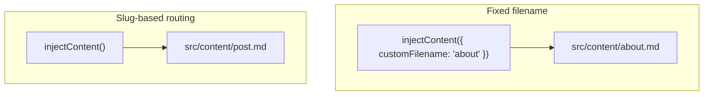

## How This Page Is Built

This page is rendered by an Angular component that loads a Markdown file from `src/content/about.md` using `injectContent()` from `@analogjs/content`.

```typescript
import { MarkdownComponent, injectContent } from '@analogjs/content';
import { toSignal } from '@angular/core/rxjs-interop';

export class About {
  readonly content = toSignal(injectContent<AboutAttributes>({ customFilename: 'about' }));
}
```

The `customFilename` option loads a specific file from `src/content/` without needing a slug route parameter. The `injectContent()` function returns an Observable of a `ContentFile` that includes the rendered HTML, typed frontmatter attributes, and a table of contents extracted from the headings.

## Frontmatter

Each content file can include a YAML frontmatter block. This page's frontmatter looks like:

```yaml
---
title: Content Pages
description: This page is rendered from a Markdown file...
---
```

The frontmatter is available as strongly-typed attributes on the `ContentFile` object. In the component template, this page's `title` and `description` are read directly from `content.attributes` to render the hero section above — no duplication between the page title and the markdown body.

## Table of Contents

The `content.toc` array is automatically generated from the headings in this Markdown file. Each entry has an `id`, `level`, and `text`:

```typescript
type TableOfContentItem = {
  id: string; // the anchor id, e.g. "how-this-page-is-built"
  level: number; // heading level: 2, 3, 4...
  text: string; // heading text
};
```

The "On this page" panel above this content is built from `content.toc` in the component template — it links directly to each heading's auto-generated anchor id.

## Syntax Highlighting

Code blocks are highlighted at build time using [Shiki](https://shiki.style/), configured in `vite.config.ts`:

```typescript
analog({
  content: {
    highlighter: 'shiki',
    shikiOptions: {
      highlighter: {
        additionalLangs: ['bash', 'shell', 'yaml'],
      },
    },
  },
});
```

Shiki uses the same grammar files as VS Code, so you get accurate highlighting for TypeScript, Angular templates, YAML, shell, and more — all resolved at build time with no client-side runtime overhead.

## Listing All Content Files

`injectContentFiles()` returns metadata for every file in `src/content/` — synchronously, resolved at build time. The panel below the content on this page is built from it:

```typescript
readonly contentFiles = injectContentFiles<AboutAttributes>();
```

Note that `injectContentFiles()` returns **metadata only** — `filename`, `slug`, and `attributes`. The content body is not included. Use `injectContent()` separately to load and render an individual file's body.

## Mermaid Diagrams

Mermaid diagrams are supported via the `loadMermaid` option on `withMarkdownRenderer()`:

```typescript
provideContent(
  withMarkdownRenderer({
    loadMermaid: () => import('mermaid'),
  }),
);
```

Mermaid blocks in Markdown are rendered client-side as SVGs. Here's how the content pipeline for this page works:

```mermaid
flowchart LR
  A["about.md<br/>(src/content/)"] -->|parsed at build time| B["ContentFile<br/>{ attributes, toc, content }"]
  B -->|injectContent()| C["Content component"]
  C -->|analog-markdown| D["Rendered page"]
```

And the two ways to load content:



For blog-style content, Analog supports resolving files by a route slug parameter instead of a fixed filename. A route like `src/app/pages/blog/posts.[slug].page.ts` can load the matching file from `src/content/posts/`:

```typescript
// resolves src/content/posts/<slug>.md from the active route
readonly post$ = injectContent<PostAttributes>();
```

Subdirectory filtering lets you scope `injectContentFiles()` to a specific folder:

```typescript
readonly posts = injectContentFiles<PostAttributes>(
  (file) => file.filename.includes('/src/content/posts/'),
);
```

This makes it straightforward to build a blog index that lists all posts with their frontmatter, then renders each post on a dedicated route.
